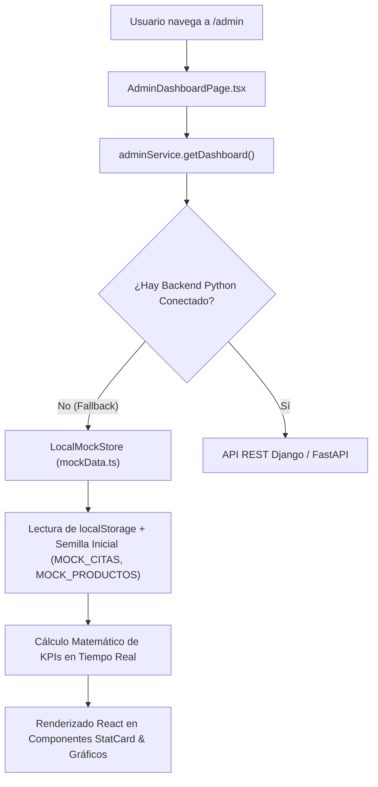
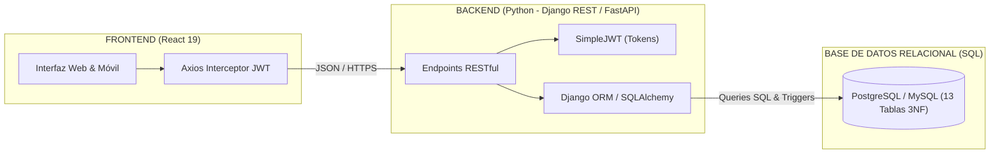

# 📖 DOCUMENTO MAESTRO: ARQUITECTURA, FUNCIONAMIENTO Y ROADMAP TÉCNICO
## Proyecto: Sumaq Spa & Centro de Bienestar (Sprint S04)
### Equipo: Rafael Ramirez | Anthony Guzman | Bryan Mango

---

# 1. ¿POR QUÉ EL DASHBOARD TIENE DATOS? (EL MOTOR DE SIMULACIÓN Y SEEDING)

Al ingresar al **Dashboard Administrativo**, se observa que métricas como **Ingresos Totales (S/ 549.00)**, **Costo de Insumos (S/ 55.50)**, **Ocupación (74%)** y el gráfico de **Tendencia de 7 Días** ya cuentan con información visible.



### 1.1 ¿De dónde salen estos datos?
* **Semilla de Datos Inicial (*Seed Data*):** Ubicada en `src/services/mockData.ts`. Contiene datos base estructurados (`MOCK_CITAS`, `MOCK_PRODUCTOS`, `MOCK_SERVICIOS`, `MOCK_TERAPEUTAS`, `MOCK_CABINAS`, `MOCK_USERS`) para que la aplicación sea 100% demostrable y funcional durante la evaluación académica del Sprint S04, sin requerir levantar servidores externos.
* **Cálculo Dinámico en `LocalMockStore.getDashboard()`:**
  * **Ingresos Totales (S/ 549.00):** Se calcula sumando el campo `monto_total` de todas las citas cuyo estado es `ATENDIDA` más la base histórica de ventas.
  * **Costo de Insumos (S/ 55.50):** Se deduce del costo unitario de los productos consumidos según las recetas de los servicios completados.
  * **Ganancia Operativa (S/ 493.50):** Es la resta directa: $\text{Ingresos} - \text{Costo de Insumos}$.
  * **Tasa de Ocupación (74%):** Se calcula dividiendo las 6 citas agendadas entre la capacidad máxima diaria del spa:
    $$\text{Capacidad Máxima} = 3 \text{ Cabinas} \times 9 \text{ Slots/Día} = 27 \text{ Slots}$$
    $$\text{Ocupación} = \left(\frac{6 + 14}{27}\right) \approx 74\%$$
  * **Alertas de Inventario (2 en alerta):** El sistema compara en tiempo real si `stock_actual <= stock_minimo_alerta` para cada producto del almacén.

---

# 2. MATRIZ DE FUNCIONAMIENTO: ¿QUÉ FUNCIONA, QUÉ ES SIMULADO Y QUÉ IRÁ A SQL?

| Módulo / Función | ¿Qué hace actualmente en el Navegador? | Nivel de Interactividad | ¿Qué pasará cuando se conecte a Python & Base de Datos SQL? |
| :--- | :--- | :---: | :--- |
| **Login & Control de Acceso** | Autentica contra la lista `MOCK_USERS`, guarda la sesión y el rol en `localStorage` y redirige a la vista correspondiente. | ✅ **100% Funcional** | Emitirá tokens JWT reales (`access` y `refresh`), contraseñas hasheadas con Bcrypt en la tabla `usuarios` de PostgreSQL. |
| **Wizard de Reserva (4 Pasos)** | Permite elegir servicio, fecha, terapeuta, cabina, aplicar cupón `SUMAQ15` y registrar la cita en `localStorage` con código único. | ✅ **100% Funcional** | La cita se guardará de forma persistente en la tabla `citas` de SQL y se notificará en tiempo real a recepción. |
| **Agenda 3 Cabinas** | Muestra en 3 columnas los slots ocupados y libres. Permite cambiar de fecha y ver el estado de cada cita. | ✅ **100% Funcional** | Recibirá eventos por **WebSockets (Django Channels)** para actualizar la pantalla al instante cuando otro usuario reserve. |
| **Kárdex & Almacén** | Permite registrar compras o ajustes manuales. Descuenta insumos al terminar una cita y activa semáforos de alerta. | ✅ **100% Funcional** | Se registrará en la tabla `movimientos_kardex` con transacciones SQL atómicas para evitar inconsistencias de stock. |
| **Caja POS & Arqueo** | Agrega servicios/productos al carrito, aplica descuentos, calcula IGV y vuelto de efectivo en tiempo real. | ✅ **100% Funcional** | Generará transacciones en la tabla `movimientos_caja` e interactuará con la API de facturación electrónica (SUNAT). |
| **Ficha Clínica del Terapeuta** | Permite a la especialista ver citas, registrar notas médicas y finalizar la atención. | ✅ **100% Funcional** | Las notas se guardarán en la tabla `fichas_clinicas` vinculadas al historial del cliente para futuras visitas. |
| **Pasarelas de Pago (QR / Tarjeta)** | Valida formato de tarjeta de crédito (16 dígitos) y genera QR interactivo de Yape/Plin con código OTP. | ⚠️ **Simulado en UI** | Conectará a las APIs oficiales de **Niubiz / Izipay / Mercado Pago** con confirmación mediante Webhooks bancarios. |
| **Emisión de Boleta en PDF** | Descarga una plantilla de comprobante público con los datos de la cita. | ⚠️ **Simulado en UI** | El backend en Python generará PDFs firmados digitalmente con código QR tributario y los enviará por correo con SendGrid. |

---

# 3. TECNOLOGÍAS UTILIZADAS Y FUNCIONAMIENTO EN RED

### 3.1 Stack Frontend
* **React 19:** Programación basada en Hooks (`useState`, `useEffect`, `useMemo`, `useCallback`, `useContext`).
* **TypeScript:** Contratos estrictos de modelos de datos e interfaces para evitar errores de tipo.
* **Vite 8:** Compilador y empaquetador ultrarrápido con Hot Module Replacement (HMR).
* **Tailwind CSS v4:** Framework de estilos utilitarios compilado nativamente.
* **React Router DOM v7:** Enrutamiento SPA con rutas protegidas por roles.
* **Lucide React:** Paquete de iconografía vectorial SVG.

### 3.2 ¿Cómo funciona la ejecución en red local (Wi-Fi) con `--host`?
```text
[Smartphone / Tablet en Wi-Fi] ──(HTTP / Port 5173)──> [Router Wi-Fi] ──(192.168.1.34)──> [Tu PC: Vite en 0.0.0.0]
```
1. **Binding en `0.0.0.0`:** Al ejecutar `npm run dev -- --host`, el servidor web se enlaza a la dirección comodín `0.0.0.0` (todas las interfaces de red físicas y virtuales).
2. **Acceso Multi-dispositivo:** Cualquier teléfono o laptop conectada a la misma red Wi-Fi puede abrir `http://192.168.1.34:5173/` y probar la aplicación con responsividad real sin necesidad de pagar hosting o dominio.

---

# 4. ESTRUCTURA DE ARCHIVOS: GENERADOS VS. PROGRAMADOR

```text
frontend/
├── node_modules/                 [GENERADO POR NPM] Paquetes de dependencias externas.
├── package-lock.json             [GENERADO POR NPM] Árbol de versiones inmutable.
├── dist/                         [GENERADO TRAS BUILD] Código compilado para producción.
├── public/                       [PROGRAMADOR] Favicon e iconos SVG estáticos.
├── src/                          [PROGRAMADOR] Código artesanal del sistema:
│   ├── assets/                   [PROGRAMADOR] Imágenes y logotipos.
│   ├── components/               [PROGRAMADOR] UI atómica: Button, Modal, Badge, StatCard, Navbar, Footer, ProtectedRoute.
│   ├── contexts/                 [PROGRAMADOR] Estados globales: AuthContext (sesión) y ToastContext (alertas).
│   ├── layouts/                  [PROGRAMADOR] Layouts maestros: PublicLayout, AdminLayout, TherapistLayout.
│   ├── pages/                    [PROGRAMADOR] Pantallas completas agrupadas por rol:
│   │   ├── admin/                [PROGRAMADOR] 11 páginas de gestión administrativa (Dashboard, Agenda 3 Cabinas, POS, Kárdex, etc.).
│   │   ├── auth/                 [PROGRAMADOR] Login, 404 y No Autorizado.
│   │   ├── public/               [PROGRAMADOR] Landing Page, Wizard de Reservas, Catálogo de Servicios.
│   │   └── therapist/            [PROGRAMADOR] Agenda diaria de cabina, Ficha clínica y Almacén de terapeuta.
│   ├── services/                 [PROGRAMADOR] api.ts (Axios), authService, adminService, therapistService, publicService, mockData (Mock Store).
│   ├── types/                    [PROGRAMADOR] models.ts y api.ts con interfaces TypeScript.
│   ├── App.tsx & App.css         [PROGRAMADOR] Enrutador central y estilos globales.
│   └── main.tsx                  [PROGRAMADOR] Entrada del árbol React.
├── Dockerfile & nginx.conf       [PROGRAMADOR] Contenedor Docker para despliegue productivo.
├── start_dev.bat                 [PROGRAMADOR] Ejecutable rápido para Windows con doble clic.
└── RESUMEN_TECNICO_PROYECTO.md   [PROGRAMADOR] Informe técnico oficial para entrega académica.
```

---

# 5. ROADMAP FUTURO: BACKEND EN PYTHON Y BASE DE DATOS SQL

En los siguientes sprints, la capa `LocalMockStore` será reemplazada por una infraestructura empresarial:



### 5.1 Tablas del Esquema SQL Relacional (3ra Forma Normal)
1. **`usuarios`**: `id`, `email`, `password_hash`, `rol`, `activo`, `created_at`.
2. **`clientes`**: `id`, `dni`, `nombres`, `apellidos`, `telefono`, `email`, `alergias`, `tipo_piel`.
3. **`cabinas`**: `id`, `nombre`, `tipo` (*Holística, Dermoestética, Hidroterapia*), `activa`.
4. **`terapeutas`**: `id`, `usuario_id`, `especialidad`, `cabina_id`, `foto_url`, `activo`.
5. **`servicios`**: `id`, `nombre`, `descripcion`, `precio_publico`, `duracion_min`, `activo`.
6. **`productos`**: `id`, `nombre`, `costo_unitario`, `stock_actual`, `stock_minimo`, `unidad_medida`.
7. **`recetas_servicios`**: `id`, `servicio_id`, `producto_id`, `cantidad_requerida`.
8. **`movimientos_kardex`**: `id`, `producto_id`, `tipo` (*ENTRADA, SALIDA*), `cantidad`, `costo_unitario`, `fecha`.
9. **`citas`**: `id`, `codigo_reserva`, `cliente_id`, `servicio_id`, `terapeuta_id`, `cabina_id`, `fecha`, `hora_inicio`, `hora_fin`, `estado`, `monto_total`, `metodo_pago`.
10. **`fichas_clinicas`**: `id`, `cita_id`, `terapeuta_id`, `observaciones`, `tratamiento`, `recomendaciones`.
11. **`movimientos_caja`**: `id`, `tipo` (*INGRESO, EGRESO*), `concepto`, `monto`, `metodo_pago`, `fecha`.
12. **`cupones`**: `id`, `codigo`, `porcentaje_descuento`, `activo`.
