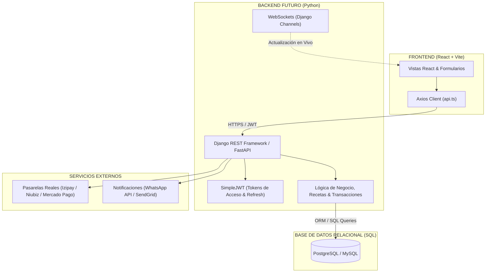

# 📖 INFORME TÉCNICO INTEGRAL DE ARQUITECTURA Y ROADMAP
## Proyecto: Sumaq Spa & Centro de Bienestar
### Integrantes: Rafael Ramirez | Anthony Guzman | Bryan Mango

---

# 1. TECNOLOGÍAS UTILIZADAS Y FUNDAMENTOS TÉCNICOS

### 1.1 Stack de Frontend
* **React 19:** Biblioteca principal para la creación de interfaces basada en componentes funcionales declarativos. Hace uso intensivo de React Hooks:
  * `useState`: Manejo del estado local (pasos del wizard, filtros de agenda, modales).
  * `useEffect`: Ciclos de vida, peticiones asíncronas y sincronización con el almacenamiento local.
  * `useMemo` & `useCallback`: Optimización del rendimiento evitando cálculos redundantes en tablas y filtros de búsqueda.
  * `useContext`: Consumo de estados globales (`AuthContext`, `ToastContext`).
* **TypeScript (~6.0 / 5.x):** Proporciona tipado estático estricto. Define interfaces de modelos de negocio (`models.ts`) y respuestas HTTP (`api.ts`), reduciendo drásticamente los errores en tiempo de ejecución.
* **Vite 8:** Herramienta de compilación moderna. Ofrece un servidor de desarrollo con *Hot Module Replacement (HMR)* instantáneo y empaquetado para producción con Rollup.
* **Tailwind CSS v4 (`@tailwindcss/vite`):** Motor de estilos basado en utilidades compilado directamente por Vite.
* **React Router DOM v7:** Enrutamiento SPA (*Single Page Application*) que gestiona rutas públicas, privadas y protegidas por roles con redirecciones automáticas.
* **Lucide React:** Colección de más de 30 iconos vectoriales SVG ultraligeros.

---

### 1.2 Funcionamiento en Red Local y Acceso Vía Wi-Fi (`--host`)
Cuando se ejecuta:
```bash
npm run dev -- --host
```
1. **Binding en `0.0.0.0`:** Por defecto, Vite solo escucha en `127.0.0.1` (`localhost`). Al usar el flag `--host`, el servidor se enlaza a la interfaz comodín `0.0.0.0`, escuchando en todas las interfaces de red físicas y virtuales de la máquina.
2. **Direccionamiento IP:** El router de la red local asigna una dirección IP privada a la computadora anfitriona (por ejemplo: `192.168.1.34`).
3. **Acceso Multi-dispositivo:** Cualquier teléfono móvil, tablet o laptop conectada al mismo Wi-Fi puede acceder ingresando en su navegador a `http://192.168.1.34:5173/`, probando la responsividad y la experiencia de usuario real en smartphones sin requerir hosting en la nube.

---

### 1.3 Diseño Responsivo (Mobile-First)
* **Breakpoints Estándar:**
  * Base (`< 640px`): Teléfonos móviles. Elementos apilados verticalmente, botones de ancho completo y menús colapsables.
  * `sm:` (≥ 640px): Móviles grandes.
  * `md:` (≥ 768px): Tablets. Formularios divididos en dos columnas y cuadrículas de 2 elementos.
  * `lg:` (≥ 1024px): Laptops y monitores. Sidebars fijas visibles a la izquierda y layouts de alta densidad.
  * `xl:` / `2xl:` (≥ 1280px): Monitores panorámicos.
* **Técnicas de Maquetación:**
  * **Flexbox y CSS Grid:** Distribución dinámica del catálogo, timeline de 3 cabinas y tarjetas de métricas.
  * **Contenedores con Scroll Horizontal (`overflow-x-auto`):** Implementados en Kárdex, Agenda y Arqueo de Caja para que las tablas no rompan el viewport en dispositivos móviles.

---

# 2. ESTRUCTURA DE CARPETAS: GENERADOS VS. PROGRAMADOR

```text
frontend/
├── node_modules/                 [GENERADO] Dependencias externas instaladas por npm.
├── public/                       [PROGRAMADOR] Archivos estáticos directos (favicon.svg, icons.svg).
├── dist/                         [GENERADO] Build compilado y minificado para producción.
├── src/                          [PROGRAMADOR] Código fuente del aplicativo
│   ├── assets/                   [PROGRAMADOR] Imágenes y logotipos (hero.png, logos).
│   ├── components/               [PROGRAMADOR] Componentes reutilizables atómicos (Button, Modal, Badge, StatCard, ProtectedRoute, Navbar, Footer).
│   ├── contexts/                 [PROGRAMADOR] Estados globales (AuthContext, ToastContext).
│   ├── layouts/                  [PROGRAMADOR] Estructuras envolventes (PublicLayout, AdminLayout, TherapistLayout).
│   ├── pages/                    [PROGRAMADOR] Vistas agrupadas por dominio:
│   │   ├── admin/                [PROGRAMADOR] 11 vistas de administración (Dashboard, Agenda Global 3 Cabinas, Caja POS, Kárdex, Citas, Usuarios, Servicios, Terapeutas, Cabinas, Marketing, Reportes).
│   │   ├── auth/                 [PROGRAMADOR] Vistas de acceso (LoginPage, UnauthorizedPage, NotFoundPage).
│   │   ├── public/               [PROGRAMADOR] Vistas para clientes (LandingPage, BookingWizardPage, BookingConfirmationPage, ServicesCatalogPage).
│   │   └── therapist/            [PROGRAMADOR] Vistas para terapeutas (TherapistAgendaPage, TherapistAppointmentDetailPage, TherapistInventoryPage).
│   ├── services/                 [PROGRAMADOR] Capa de integración y datos (api.ts, authService.ts, publicService.ts, adminService.ts, therapistService.ts, mockData.ts).
│   ├── types/                    [PROGRAMADOR] Tipos TypeScript (models.ts, api.ts).
│   ├── App.css & index.css       [PROGRAMADOR] Directivas de Tailwind CSS y personalización de temas.
│   ├── App.tsx                   [PROGRAMADOR] Enrutador central con todas las rutas y guardias de seguridad.
│   └── main.tsx                  [PROGRAMADOR] Montaje del árbol React en el DOM.
├── .gitignore                    [PROGRAMADOR] Reglas de exclusión para Git.
├── .oxlintrc.json                [PROGRAMADOR] Configuración del linter estático rápido.
├── Dockerfile & nginx.conf       [PROGRAMADOR] Despliegue contenerizado con Nginx.
├── package.json                  [PROGRAMADOR] Declaración de dependencias y scripts de ejecución.
├── package-lock.json             [GENERADO] Árbol inmutable de paquetes y dependencias.
├── start_dev.bat                 [PROGRAMADOR] Script de ejecución con doble clic en Windows.
└── tsconfig*.json & vite.config  [PROGRAMADOR] Configuración de compiladores TypeScript y Vite.
```

---

# 3. DESGLOSE DETALLADO DEL CÓDIGO Y LÓGICA POR MÓDULOS

### 3.1 Layouts y Sidebars
* **`PublicLayout.tsx`:** Renderiza el `Navbar` superior fijo, el contenedor dinámico `<Outlet />` y el `Footer`.
* **`AdminLayout.tsx`:** Sidebar con 10 opciones administrativas, header con contador reactivo de insumos críticos y dropdown de perfil con logout. En móvil se convierte en menú deslizante.
* **`TherapistLayout.tsx`:** Barra lateral exclusiva para especialistas con acceso rápido a su agenda del día, historial de atenciones y solicitud de insumos.

### 3.2 Wizard de Reserva en 4 Pasos (`BookingWizardPage.tsx`)
1. **Paso 1 (Servicio y Fecha):** Selección de tratamiento y fecha deseada.
2. **Paso 2 (Terapeuta, Cabina y Slots):** Consulta y cálculo dinámico de bloques de 60 minutos disponibles por cabina y especialista.
3. **Paso 3 (Datos del Cliente y Cupones):** Formulario con validación estricta y cálculo de descuentos con cupones (ej. `SUMAQ15` aplica 15% de descuento).
4. **Paso 4 (Pasarela de Pago Simulada):** Generación de QR interactivo de Yape/Plin, pasarela de tarjeta y pago en efectivo. Emite código de cita único (ej. `SQ-20260901-8421`).

### 3.3 Agenda Global de 3 Cabinas (`GlobalAgendaPage.tsx`)
Tablero interactivo simultáneo para:
* **Cabina 1 (Holística):** Masajes y aromaterapia.
* **Cabina 2 (Dermoestética):** Faciales y cosmiatría.
* **Cabina 3 (Hidroterapia):** Exfoliaciones corporales y sales de baño.
Permite visualizar estados de citas en tiempo real, filtrar por fecha y reprogramar horarios.

### 3.4 Kárdex e Inventario (`AdminInventoryPage.tsx`)
Control de stock con umbral de alerta mínima. Calcula costos unitarios y genera movimientos automáticos de salida cuando una cita concluye.

### 3.5 Caja POS (`AdminCashRegisterPage.tsx`)
Gestión de caja chica, registro de ingresos (servicios/productos), egresos y arqueo discriminado por efectivo, Yape, Plin y tarjeta.

### 3.6 Ficha Clínica del Terapeuta (`TherapistAppointmentDetailPage.tsx`)
Registro de notas de evolución médica/estética del cliente, alergias y deducción automática de insumos según la receta del servicio.

---

# 4. ROADMAP FUTURO: LO QUE FALTA POR IMPLEMENTAR

Actualmente el prototipo funciona de forma 100% autónoma mediante `mockData.ts` y `localStorage`. Para llevar el sistema a **producción comercial** en los siguientes sprints, se deben implementar las siguientes fases:



---

### 4.1 Backend en Python (Django REST Framework / FastAPI)
* **Arquitectura de API RESTful:**
  * Reemplazar los servicios mockeados (`mockData.ts`) conectando `src/services/api.ts` con endpoints reales en Python.
* **Autenticación y Seguridad JWT:**
  * Emisión de tokens de acceso (`access_token`, 15 min) y refresco (`refresh_token`, 7 días) mediante `djangorestframework-simplejwt`.
  * Hashing seguro de contraseñas con algoritmos Argon2 o Bcrypt.
* **Control Transaccional Atómico (`@transaction.atomic`):**
  * Asegurar que al confirmar una cita o registrar un cobro, la creación de la cita, el descuento en el Kárdex de inventario y el ingreso en caja se ejecuten en una sola transacción segura (si uno falla, todo se revierte).
* **WebSockets en Tiempo Real (Django Channels):**
  * Sincronización instantánea de la **Agenda Global de 3 Cabinas**. Cuando un recepcionista o cliente reserve una cita, las pantallas de las terapeutas y administradores se actualizarán en milisegundos sin necesidad de recargar la página (`F5`).

---

### 4.2 Base de Datos Relacional SQL (PostgreSQL / MySQL)
Se diseñará un modelo relacional en tercera forma normal (3NF) que incluirá las siguientes tablas principales:

```text
1. usuarios (id, nombre, email, password_hash, rol_id, activo, created_at)
2. roles (id, nombre [ADMIN, RECEPCIONISTA, TERAPEUTA, CLIENTE], permisos)
3. clientes (id, nombres, apellidos, dni, telefono, email, fecha_nacimiento, alergias, tipo_piel)
4. cabinas (id, nombre, tipo [Holistica, Dermoestetica, Hidroterapia], activa)
5. terapeutas (id, usuario_id, especialidad, cabina_id, activo)
6. servicios (id, nombre, descripcion, precio_publico, duracion_min, imagen_url, activo)
7. productos (id, codigo_sku, nombre, descripcion, costo_unitario, stock_actual, stock_minimo, unidad_medida)
8. recetas_servicios (id, servicio_id, producto_id, cantidad_requerida)
9. movimientos_kardex (id, producto_id, tipo [ENTRADA, SALIDA], cantidad, costo_unitario, referencia_tipo, referencia_id, fecha)
10. citas (id, codigo_reserva, cliente_id, servicio_id, terapeuta_id, cabina_id, fecha, hora_inicio, hora_fin, estado, subtotal, descuento, monto_total, metodo_pago, cupon_id)
11. fichas_clinicas (id, cita_id, terapeuta_id, observaciones_piel, tratamiento_realizado, recomendaciones, firma_digital)
12. movimientos_caja (id, tipo [INGRESO, EGRESO], concepto, monto, metodo_pago, cita_id, usuario_id, fecha)
13. cupones_descuento (id, codigo, porcentaje_descuento, fecha_inicio, fecha_fin, usos_maximos, activo)
```

* **Triggers y Vistas SQL:**
  * Trigger automático para descontar stock en la tabla `productos` cuando se inserte una salida en `movimientos_kardex`.
  * Vistas indexadas (`Materialized Views`) para calcular métricas financieras y KPIs del Dashboard sin sobrecargar el servidor.

---

### 4.3 Integraciones y Pasarelas de Pago Reales
* **Pasarelas de Pago en Producción:**
  * Integración con SDKs de **Izipay**, **Niubiz** o **Mercado Pago** mediante Webhooks seguros que verifiquen el pago antes de confirmar la reserva en la base de datos.
* **Comprobantes Electrónicos (SUNAT / Facturación):**
  * Módulo de emisión automática de boletas y facturas electrónicas en formato XML/PDF.
* **Notificaciones Automáticas:**
  * Envío de confirmaciones y recordatorios de citas por **WhatsApp Business API** y correos con voucher PDF adjunto mediante **SendGrid**.
